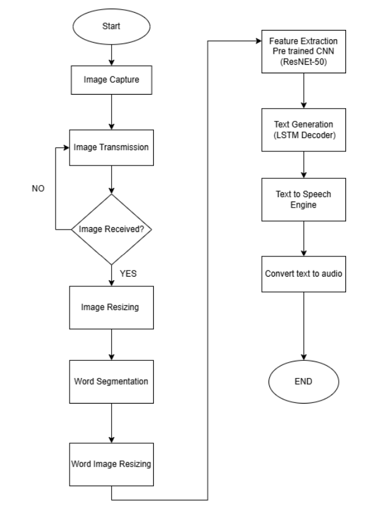
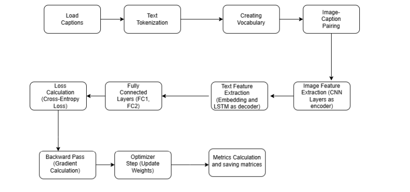
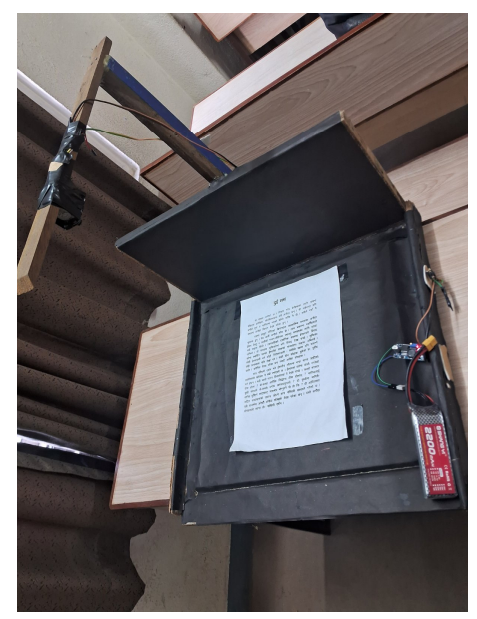
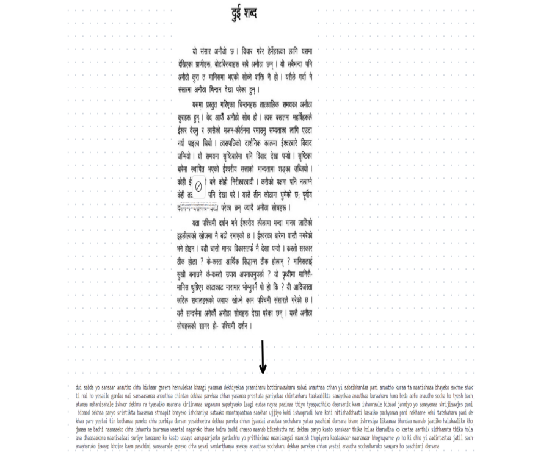

# 📘 Visually Impaired Reading Assistant  
_A Final Year Major Project — by Arjun Koirala and Sushmit Paudel_

---

## 🎥 Demo Video ▶️  
👉 [Watch the full demo video on Google Drive](https://drive.google.com/your-video-link)  
_(Externally hosted)_

---

## 📌 Project Overview

**Visually Impaired Reading Assistant** is a lightweight, offline system designed to help visually impaired individuals read printed **Nepali (Devanagari)** books. With the press of a button, the system captures an image of a book page and plays back the spoken version of the printed words — completely offline.

The system follows a **Master-Slave architecture**, where:
- The **Slave device (ESP32-CAM)** acts as the camera interface.
- The **Master device (Laptop)** performs image processing, word recognition, and audio playback.

For full technical details, see the [Project Report](report.pdf).

---

## 🔁 Slave Phase (Image Capturing Device)

**What happens on the ESP32-CAM side (the “camera button” part):**

1. **User presses a button** connected to the ESP32-CAM.
2. The ESP32 sends a request to the laptop (master) to check if it’s ready to receive a photo.
3. If the laptop is ready:
   - The ESP32 takes a high-quality photo of the text.
   - The photo is sent via Wi-Fi using a secure API call to the laptop.
   - (Security headers were added to simulate real-world use.)

📝 *Note: The ESP32 doesn’t play any audio. It simply acts as the “eyes” of the system.*

---

## 🧠 Master Phase (Laptop — Brain & Speaker)

**What happens on the laptop/server side after receiving the photo:**

---

### 🖼️ 1. Image Preprocessing

- Converts photo into a clear black-text-on-white-background format.
- Works regardless of original text or background color.
- Ensures the image is clean for recognition.

---

### ✂️ 2. Word Segmentation

- Enlarges the image by 1.7× to better detect words.
- Identifies and cuts out each **word** (not individual letters).
- If any word appears too large, it’s split in half to correct spacing errors.
- Words are saved sequentially for prediction.

---

### 🔍 3. Text Prediction

- Each segmented word image is sent to a custom-built **ResNet-50 + LSTM** model.
- The model was trained on 70,000+ Devanagari words.
- It predicts the text in English characters (e.g., "aama" from segmented "a a m a").

---

### 🔊 4. Audio Output

- Predicted words are matched to a dictionary of known words.
  - Exact matches are played.
  - Close matches are auto-corrected.
  - Unknown words are skipped.
- Each matched word triggers playback of a **pre-recorded audio file**.
- Audio is adjusted in pitch to sound more natural.

🎧 The final effect: the system "reads" the book aloud, word by word.

---

## 📈 Model Metrics

| Metric | Value |
|--------|-------|
| Training Accuracy | ~80% |
| Validation Accuracy | ~70% |
| BLEU-4 Score | **0.8056** |
| Dataset | 65,000+ manually segmented word images |

---

## 🛠️ Tech Stack

- **Software**: Python · PyTorch · OpenCV · Flask API · Arduino IDE  
- **Hardware**: ESP32-CAM · MicroSD · 12V Li-ion · Buck Converter · Button Interface  
- **ML Components**: ResNet-50 encoder + LSTM decoder, BLEU evaluation  
- **Communication**: Custom HTTP API with lightweight security headers  

---

## 📦 Download Trained Model

👉 [Click here to download the trained model (.pt)](https://drive.google.com/file/d/your-model-id/view?usp=sharing)


> The model used for word-level Devanagari OCR prediction is hosted on Google Drive due to file size limits.

> Download best_model.pth and add it on your root folder.


## 🧑‍💻 Setup & Execution

### Hardware Setup:
- Connect ESP32-CAM, power supply, and a physical button.
- Flash the firmware using Arduino IDE.

### Laptop/Server Setup:
```bash
# Start the master controller
python master.py
```
- Make sure both devices are on the same Wi-Fi network.
- Press the button on the ESP32 to trigger reading.

> Got an issue or have question? Feel free to contact me.
---


## 🖼️ Visual System Flow

- 
- 
- 
- 

---

## 👥 Contributors

- **Arjun Koirala** — Software Engineer & System Designer  
- **Sushmit Paudel** — Hardware Engineer & Software Designer  

---

## 🤝 Supported By

> **Gokul Subedi**  
> _Technical Advisor, Mentor & Lead Developer Support_  

This project proudly acknowledges the invaluable support, architectural insight, and technical mentorship provided by **Gokul Subedi**.

---

## 🪪 License

Licensed under the [MIT License](https://opensource.org/licenses/MIT)

---

## 📌 Project Status

- ✅ Prototype deployed and tested successfully
- ✅ Real-time performance with offline playback
- 🔄 Roadmap includes dynamic TTS and support for mobile deployment

---

> ⚠️ This is a public-sharing copy. Dataset and select training scripts are withheld.

> ⚠️ All IMages in here are added form the project report itself.

<sub><p align="center">📘 This repository and README are maintained by <a href="https://github.com/MeSafal/" target="_blank"><u><strong>Gokul Subedi</strong></u></a> in support of the original developers.</p></sub>
